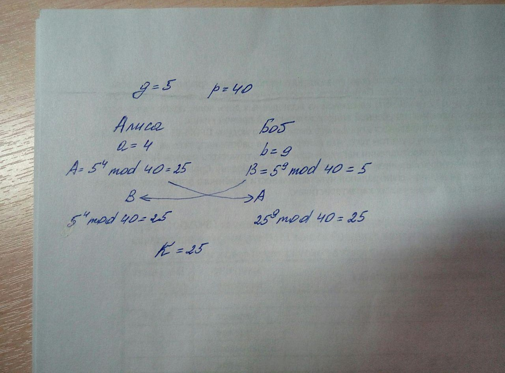

# Практика: криптография
## Задание 1. Шифр Цезаря
Расшифровать с помощью программы на Python.
Сообщение: ПГПГ ПЮОГ УГПЦ

## Задание 2. Алгоритм Диффи-Хэллмана
Нарисовать схему обмена ключом в соответсвии с вариантом.
Пример:

Вариант | g | p | a | b
--- | --- | --- | --- | ---
1 | 7 | 11 | 6 | 7
2 | 5 | 11 | 3 | 2
3 | 5 | 17 | 8 | 4
4 | 13 | 17 | 10 | 4
5 | 23 | 41 | 21 | 22

## Задание 3. Алгоритм RSA
Расшифровать сообщения в соответствии с вариантом.

Вариант | Шифротекст | Закрытый ключ (d, n)
--- | --- | ---
1 | 37491106562115090917694123587243808173 | (181513048037204381691863100525923435561, 191479498107926254150745643129472279087)
2 | 5075077891375593063470369707299930278 | (255880502049737012633680452691019962541, 261447733250484929599996423415732814347)
3 | 5266361999158735012651706778623473466 | (88085821740255019281396127954354155505, 150691024589536182979895594232321111683)
4 | 77943900674091965585848804784065471694 | (37821437834233000364434737378023227717, 165990362637620658941279770776944357891)
5 | 114197515626858193849703597327432334241 | (11907559208026732088046114062446164773, 180633940861194828902469082772041171949)

Подсказка. Для возведения в степень по модулю в Python используется функция pow(x, y, z)

## Задание 4. Электронно-цифровая подпись
[Изображение 1](ufoctf.bmp) и [Изображение 2](ufoctf2.bmp).
Сигнатура:
39330339222532174859646150966541980546500757694492678767549681339931886226570,
Открытый ключ (e, n): (2356615979, 91321344012513756563105091511611134251825913515476610079756666932311335573273)
Определить какое из изображений было неправомерно изменено с помощью программы на Python. Сигнатура была получена из хэша md5 файла

Подсказка: хэш файла - это хэш его содержимого. hashlib - модуль Python для работы с хэшами
